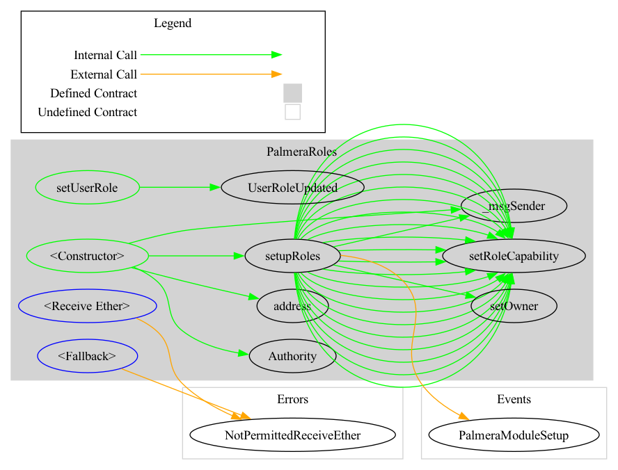
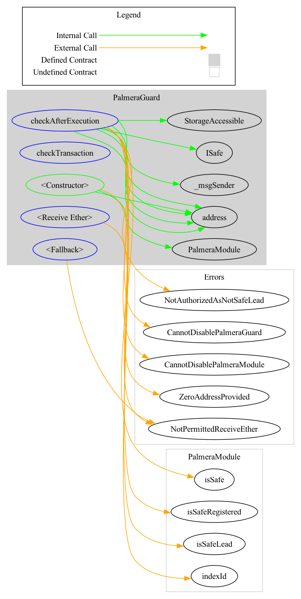

# Palmera Module Technical Specification

## Table of Contents

- Project Overview
- Functional Requirements
  - 1.1. Roles and Authorizations
  - 1.2. Features
  - 1.3. Business Logic
  - 1.4. Use Cases
- Technical Requirements
  - 2.1. Deployment Instructions
  - 2.2. Architectural Overview
  - 2.3. Contract Information

## Project Overview

The Palmera Module is an orchestration framework for On-Chain Organizations based on the Safe ecosystem, enabling the creation and management of hierarchies and permissions within On-Chain Organizations. It extends the capabilities of Safe’s multisig wallet to manage assets and treasury in a secure and hierarchical manner. More Details in [Palmera Module Docs](https://docs.palmeradao.xyz/palmera).

## Functional Requirements

### 1.1. Roles and Authorizations

This Roles is based on [Solmate Roles Contract](https://github.com/transmissions11/solmate/tree/main) and is used to manage the roles and permissions within the Palmera Module. The roles are as follows:

- **Safe Owner**: Can register new Org and manage organizational settings.
- **Safe Lead / EOA**: Can add or remove owners and manage somes roles and permissions within their organization.
- **Safe Wallets**: Can add or remove members and execute transactions within their authorization.
- **Root Safe Wallets**: Can manage the entire organization and delegate roles and permissions and execute transactions on behalf of other safes into their organization/tree/leaf.

### 1.2. Features

#### Enable the Palmera Module

This is the very first action required to access the features of the Palmera Module. It involves two separate transactions to Enable Module and Set Guard. More details [Safe Docs Modules](https://docs.safe.global/advanced/smart-account-modules) and [Safe Docs Guard](https://docs.safe.global/advanced/smart-account-guards) and follows the steps below:

1. **Enable the Module**:
    - `enableModule() - ModuleManager.sol`
2. **Set Guard**:
    - `setGuard() - GuardManager.sol`

Both actions need to be called by the safe that will be set as the root safe. They can be bundled into one transaction using a service like [Safe](https://app.safe.global/) and more Details about it! in [Palmera Module Docs](https://docs.palmeradao.xyz/palmera).

#### Register an Organization

- **Function**: `registerOrg()`
- **Description**: Registers an organization and sets the calling  safe as the root  safe.

#### Add a New Safe

- **Function**: `addSafe()`
- **Description**: Adds a new root  safe. Only an existing root  safe can add another root  safe.

#### Add New Roles

- **Function**: `setRole()`
- **Description**: Assigns a new role to a user. This must be called by the root  safe.

#### Add a New Root Safe

- **Function**: `createRootSafe()`
- **Description**: A safe can become a Root Safe into On-chain Organization, and handle a different leaf.

#### Remove a Safe

- **Function**: `removeSafe()`
- **Description**: Removes a  safe. This must be called by the root  safe.

#### Disconnect a Safe

- **Function**: `disconnectSafe()`
- **Description**: Disconnects a  safe from the organization. This must be called by the root safe.

#### Execute a Transaction on Behalf Of

- **Function**: `execTransactionOnBehalf()`
- **Description**: Allows a root/super safe or safe lead to execute transactions on behalf of a sub/child safe.

### 1.3. Business Logic

The Palmera Module allows On-Chain Organizations to efficiently manage their hierarchical structures by extending the  Safe multisig wallet capabilities to support multiple levels of administration and access control. Each Safe can have subsafes and supersafes, creating a tree structure that enforces permissions and roles within the organization.

#### Detailed Business Logic Explanation

- **Hierarchical Management**: Each Safe can act as a root or subsafe, creating a dynamic hierarchy. This hierarchy allows organizations to structure their asset management and control systems according to their internal governance models.
- **Permissions and Roles**: Roles can be dynamically assigned and revoked, ensuring that only authorized entities can perform specific actions. This fine-grained control is crucial for maintaining security and operational integrity within the DAO.
- **Transaction Authorization**: Transactions can be executed on behalf of other safes, enabling higher-level safes to manage and delegate actions down the hierarchy. This ensures that strategic decisions and actions can be centrally controlled while operational tasks can be delegated.

### 1.4. Use Cases

- **Hierarchy Creation**: Establishing and managing hierarchical structures within On-Chain Organizations.
- **Permission Management**: Administering roles and permissions across different levels of the organization, Managing and assigning roles, ensuring that only authorized users can perform certain actions.
- **Transaction Execution**: Securely executing transactions on behalf of other safes, ensuring control and accountability.
- **Protecting DAO assets from unauthorized disconnection:** Ensuring that safes cannot be disconnected from the Palmera Module without proper authorization, protecting the assets of the DAO.

## Technical Requirements

### 2.1. Deployment Instructions

Is important to follow the steps below to deploy the Palmera Module, any way we prepare in foundry a Script to deploy the Palmera Module with all dependencies. Need to introduce the ENV variables in the `.env` file, follow the example in the `.env.example` file.

#### **Deploy the Palmera Libraries**

- **Deploy in Sepolia:**

```bash
make deploy-palmera-libraries
```

or

- **Deploy in Polygon:**

```bash
make deploy-palmera-libraries-polygon
```

Is important to deploy the Palmera Libraries before the Palmera Environment, and take a count that in Foundry for linking the Palmera Environment with the Palmera Libraries, we need to introduce the address of the Palmera Libraries in the `foundry.toml` file, into profile default, field `libraries`.

#### **Deploy the Palmera Environment**

- **Deploy in Sepolia:**

```bash
make deploy-palmera-env 
```

or

- **Deploy in Polygon:**

```bash
make deploy-palmera-env-polygon
```

_Steps into the Script_:

- **Create Instance of the CREATE3 Factory contract**. This contract is used to get deterministic addresses for the Palmera Module contract.
- **Predict with CREATE3 Factory Palmera Module contract** with use the CREATE3 Factory to get deterministic addresses and use in the Palmera Roles contract constructor.
- **Deploy the Palmera Roles contract** with the address of the Palmera Module got in the step before.
- **Deploy the Palmera Module contract** with the following parameters:
  - `authorityAddress` - Address of the Palmera Roles Deployed.
  - `maxDepthTreeLimitInitial` - Maximum depth tree limit for All On-Chain Organization.
- **Deploy the Palmera Guard contract** with the address of the Palmera Module.

### 2.2. Architectural Overview

The system consists of a main Palmera Environment contract managing multiple SubSafes with configurable permissions and memberships. The architecture includes:

- **PalmeraModule**: Core module managing the hierarchy and transaction execution.
- **PalmeraRoles**: Manages role assignments and permissions.
- **PalmeraGuard**: Ensures safes cannot disconnect without authorization.
- **Helpers**: Provides utility functions.
- **DenyHelper**: Manages allow/deny lists for various operations.

### 2.3. Contract Information

#### PalmeraModule

**Title:** Palmera Module

##### Variables

- **Module Name**: `string NAME` - Name of the Palmera Module.
- **Module Version**: `string VERSION` - Version of the Palmera Module.
- **Index ID**: `uint256 indexId` - Index ID of the safe.
- **Max Depth Tree Limit**: `uint256 maxDepthTreeLimit` - Maximum depth tree limit.
- **Roles Authority**: `address rolesAuthority` - Address of the role authority.
- **Safe Index**: `mapping(bytes32 => uint256[]) indexSafe` - Index of Safe by organization.
- **Depth Tree Limit**: `mapping(bytes32 => uint256) depthTreeLimit` - Depth tree limit by organization.
- **Nonce**: `mapping(bytes32 => uint256) nonce` - Control nonce of the Palmera Module per organization.
- **Safes**: `mapping(bytes32 => mapping(uint256 => struct DataTypes.Safe)) safes` - Mapping of safes by organization.

##### Modifiers

- **SafeIdRegistered**:

    ```solidity
    modifier SafeIdRegistered(uint256 safe)
    ```

  - Validates if the Safe is registered.
- **SafeRegistered**:

    ```solidity
    modifier SafeRegistered(address safe)
    ```

  - Validates if the Safe address is registered.
- **IsRootSafe**:

    ```solidity
    modifier IsRootSafe(address safe)
    ```

  - Validates if the address is a Root Safe.

##### Key Functions

- **constructor**:

    ```solidity
    constructor(address authorityAddress, uint256 maxDepthTreeLimitInitial) public
    ```

  - Initializes the Palmera Module with the given authority address and maximum depth tree limit.
- **fallback**:

    ```solidity
    fallback() external
    ```

  - Called when someone sends ETH or calls a non-existent function.
- **receive**:

    ```solidity
    receive() external payable
    ```

  - Called when someone sends ETH to the contract without data.
- **execTransactionOnBehalf**:

    ```solidity
    function execTransactionOnBehalf(bytes32 org, address superSafe, address targetSafe, address to, uint256 value, bytes data, enum Enum
    ```

    Operation operation, bytes signatures) external payable returns (bool result)`
  - Executes a transaction on behalf of another Safe with custom owner rights checks.
  - **Parameters**:
    - `org`: ID of the organization.
    - `superSafe`: Address of the super Safe.
    - `targetSafe`: Address of the target Safe.
    - `to`: Address to which the transaction is being sent.
    - `value`: Value (ETH) sent with the transaction.
    - `data`: Data payload of the transaction.
    - `operation`: Type of operation (call or delegatecall).
    - `signatures`: Packed signature data (v, r, s).
  - **Returns**:
    - `result`: `true` if the transaction was successful.
- **addOwnerWithThreshold**:

    ```solidity
    function addOwnerWithThreshold(address ownerAdded, uint256 threshold, address targetSafe, bytes32 org) external
    ```

  - Adds an owner and sets a threshold without the normal multisig signature check.
  - **Parameters**:
    - `ownerAdded`: Address of the new owner.
    - `threshold`: New threshold for the Safe.
    - `targetSafe`: Address of the target Safe.
    - `org`: ID of the organization.
- **removeOwner**:

    ```solidity
    function removeOwner(address prevOwner, address ownerRemoved, uint256 threshold, address targetSafe, bytes32 org) external
    ```

  - Removes an owner without the normal multisig signature check.
  - **Parameters**:
    - `prevOwner`: Address of the previous owner.
    - `ownerRemoved`: Address of the owner to be removed.
    - `threshold`: New threshold for the Safe.
    - `targetSafe`: Address of the target Safe.
    - `org`: ID of the organization.
- **setRole**:

    ```solidity
    function setRole(enum DataTypes.Role role, address user, uint256 safeId, bool enabled) external
    ```

  - Assigns roles to users.
  - **Parameters**:
    - `role`: Role to be assigned.
    - `user`: User to whom the role is assigned.
    - `safeId`: ID of the Safe
    - `safeId`: ID of the Safe.
    - `enabled`: Enable or disable the role.
- **registerOrg**:

    ```solidity
    function registerOrg(string orgName) external returns (uint256 safeId)
    ```

  - Registers an organization.
  - **Parameters**:
    - `orgName`: Name of the organization.
  - **Returns**:
    - `safeId`: ID of the registered Safe.
- **createRootSafe**:

    ```solidity
    function createRootSafe(address newRootSafe, string name) external returns (uint256 safeId)
    ```

  - Creates a Root Safe.
  - **Parameters**:
    - `newRootSafe`: Address of the new Root Safe.
    - `name`: Name of the Safe.
  - **Returns**:
    - `safeId`: ID of the created Safe.
- **addSafe**:

    ```solidity
    function addSafe(uint256 superSafeId, string name) external returns (uint256 safeId)
    ```

  - Adds a Safe to an organization.
  - **Parameters**:
    - `superSafeId`: ID of the superSafe.
    - `name`: Name of the Safe.
  - **Returns**:
    - `safeId`: ID of the added Safe.
- **removeSafe**:

    ```solidity
    function removeSafe(uint256 safeId) public
    ```

  - Removes a Safe and reassigns all children to the superSafe.
  - **Parameters**:
    - `safeId`: ID of the Safe to be removed.
- **disconnectSafe**:

    ```solidity
    function disconnectSafe(uint256 safeId) external
    ```

  - Disconnects a Safe from an organization.
  - **Parameters**:
    - `safeId`: ID of the Safe to be disconnected.
- **removeWholeTree**:

    ```solidity
    function removeWholeTree(uint256 rootSafeId) external
    ```

  - Removes the entire tree of a Root Safe.
  - **Parameters**:
    - `rootSafeId`: ID of the Root Safe.
- **promoteRoot**:

    ```solidity
    function promoteRoot(uint256 safeId) external
    ```

  - Promotes a Safe to a Root Safe.
  - **Parameters**:
    - `safeId`: ID of the Safe to be promoted.
- **updateSuper**:

    ```solidity
    function updateSuper(uint256 safeId, uint256 newSuperSafeId) external
    ```

  - Updates the superSafe of a Safe.
  - **Parameters**:
    - `safeId`: ID of the Safe to be updated.
    - `newSuperSafeId`: ID of the new superSafe.
- **updateDepthTreeLimit**:

    ```solidity
    function updateDepthTreeLimit(bytes32 org, uint256 newDepthTreeLimit) external
    ```

  - Updates the depth tree limit.
  - **Parameters**:
    - `org`: ID of the organization.
    - `newDepthTreeLimit`: New depth tree limit.
- **addToList**:

    ```solidity
    function addToList(bytes32 org, address account) external
    ```

  - Adds an address to the list.
  - **Parameters**:
    - `org`: ID of the organization.
    - `account`: Address to be added.
- **dropFromList**:

    ```solidity
    function dropFromList(bytes32 org, address account) external
    ```

  - Removes an address from the list.
  - **Parameters**:
    - `org`: ID of the organization.
    - `account`: Address to be removed.
- **enableAllowlist**:

    ```solidity
    function enableAllowlist(bytes32 org) external
    ```

  - Enables the allowlist.
  - **Parameters**:
    - `org`: ID of the organization.
- **enableDenylist**:

    ```solidity
    function enableDenylist(bytes32 org) external
    ```

  - Enables the denylist.
  - **Parameters**:
    - `org`: ID of the organization.
- **disableDenyHelper**:

    ```solidity
    function disableDenyHelper(bytes32 org) external
    ```

  - Disables all lists.
  - **Parameters**:
    - `org`: ID of the organization.
- **getSafeInfo**:

    ```solidity
    function getSafeInfo(uint256 safeId) external view returns (...)
    ```

  - Retrieves all information about a Safe.
  - **Parameters**:
    - `safeId`: ID of the Safe.
- **hasNotPermissionOverTarget**:

    ```solidity
    function hasNotPermissionOverTarget(uint256 safeId, address account) public view returns (bool)
    ```

  - Checks if the caller has permission over the target Safe.
  - **Parameters**:
    - `safeId`: ID of the Safe.
    - `account`: Address to be checked.
  - **Returns**:
    - `bool`: `true` if the caller has no permission.
- **isOrgRegistered**:

    ```solidity
    function isOrgRegistered(bytes32 org) public view returns (bool)
    ```

  - Checks if the organization is registered.
  - **Parameters**:
    - `org`: ID of the organization.
  - **Returns**:
    - `bool`: `true` if the organization is registered.
- **isRootSafeOf**:

    ```solidity
    function isRootSafeOf(uint256 safeId, uint256 potentialRootSafeId) public view returns (bool)
    ```

  - Checks if an address is the Root Safe of a Safe.
  - **Parameters**:
    - `safeId`: ID of the Safe.
    - `potentialRootSafeId`: ID of the potential Root Safe.
  - **Returns**:
    - `bool`: `true` if the address is the Root Safe.
- **isTreeMember**:

    ```solidity
    function isTreeMember(uint256 safeId, uint256 potentialMemberSafeId) public view returns (bool)
    ```

  - Checks if a Safe is a member of the tree of another Safe.
  - **Parameters**:
    - `safeId`: ID of the Safe.
    - `potentialMemberSafeId`: ID of the potential member Safe.
  - **Returns**:
    - `bool`: `true` if the Safe is a member of the tree.
- **isLimitLevel**:

    ```solidity
    function isLimitLevel(uint256 safeId, uint256 level) public view returns (bool)
    ```

  - Validates if the depth tree limit is reached.
  - **Parameters**:
    - `safeId`: ID of the Safe.
    - `level`: Depth level to be checked.
  - **Returns**:
    - `bool`: `true` if the limit is reached.
- **isSuperSafe**:

    ```solidity
    function isSuperSafe(uint256 safeId, uint256 potentialSuperSafeId) public view returns (bool)`
    ```

  - Checks if a Safe is the superSafe of another Safe.
  - **Parameters**:
    - `safeId`: ID of the Safe.
    - `potentialSuperSafeId`: ID of the potential superSafe.
  - **Returns**:
    - `bool`: `true` if the Safe is the superSafe.
- **isPendingRemove**:

    ```solidity
    function isPendingRemove(uint256 safeId) public view returns (bool)
    ```

  - Checks if a Safe is pending disconnection.
  - **Parameters**:
    - `safeId`: ID of the Safe.
  - **Returns**:
    - `bool`: `true` if the Safe is pending disconnection.
- **isSafeRegistered**:

    ```solidity
    function isSafeRegistered(uint256 safeId) public view returns (bool)
    ```

  - Verifies if the Safe is registered in any organization.
  - **Parameters**:
    - `safeId`: ID of the Safe.
  - **Returns**:
    - `bool`: `true` if the Safe is registered.
- **getRootSafe**:

    ```solidity
    function getRootSafe(uint256 safeId) public view returns (uint256)
    ```

  - Retrieves the Root Safe of a Safe.
  - **Parameters**:
    - `safeId`: ID of the Safe.
  - **Returns**:
    - `uint256`: ID of the Root Safe.
- **getSafeAddress**:

    ```solidity
    function getSafeAddress(uint256 safeId) external view returns (address)
    ```

  - Retrieves the address of a Safe.
  - **Parameters**:
    - `safeId`: ID of the Safe.
  - **Returns**:
    - `address`: Address of the Safe.
- **getOrgHashBySafe**:

    ```solidity
    function getOrgHashBySafe(uint256 safeId) public view returns (bytes32)
    ```

  - Retrieves the organization hash by Safe.
  - **Parameters**:
    - `safeId`: ID of the Safe.
  - **Returns**:
    - `bytes32`: Hash of the organization.
- **getSafeIdBySafe**:

    ```solidity
    function getSafeIdBySafe(address safe) public view returns (uint256)
    ```

  - Retrieves the Safe ID by address.
  - **Parameters**:
    - `safe`: Address of the Safe.
  - **Returns**:
    - `uint256`: ID of the Safe.

#### PalmeraRoles

**Title:** Palmera Roles

##### Variables

- **Module Name**: `string NAME` - Name of the Palmera Roles.
- **Module Version**: `string VERSION` - Version of the Palmera Roles.

##### Key Functions

- **constructor**: `constructor(address palmeraModule) public`
  - Initializes the Palmera Roles contract with the address of the Palmera Module.
- **fallback**: `fallback() external`
  - Called when someone sends ETH or calls a non-existent function.
- **receive**: `receive() external payable`
  - Called when someone sends ETH to the contract without data.
- **setupRoles**:

  ```solidity
  function setupRoles(address palmeraModule) internal
  ```

  - Configures role access control on Authority.
- **setUserRole**:

  ```solidity
  function setUserRole(address user, uint8 role, bool enabled) public virtual
  ```

  - Assigns a role to a user.
  - **Parameters**:
    - `user`: `address` - Address of the user.
    - `role`: `uint8` - Role to be assigned.
    - `enabled`: `bool` - Enable or disable the role.

#### PalmeraGuard

**Title:** Palmera Guard

##### Variables

- **Module Name**: `string NAME` - Name of the Palmera Guard.
- **Module Version**: `string VERSION` - Version of the Palmera Guard.
- **Palmera Module**: `contract PalmeraModule palmeraModule` - Reference to the Palmera Module contract.

##### Key Functions

- **constructor**: `constructor(address payable palmeraModuleAddr) public`
  - Initializes the Palmera Guard contract with the address of the Palmera Module.
- **fallback**: `fallback() external`
  - Called when someone sends ETH or calls a non-existent function.
- **receive**: `receive() external payable`
  - Called when someone sends ETH to the contract without data.
- **checkTransaction**:

  ```solidity
  function checkTransaction(address to, uint256 value, bytes calldata data, Enum.Operation operation, uint256 safeTxGas, uint256 baseGas, uint256 gasPrice, address gasToken, address payable refundReceiver, bytes memory signatures, address msgSender) external
  ```

  - Checks if a transaction is allowed.
  - **Parameters**:
    - `to`: `address` - Target address.
    - `value`: `uint256` - Value to be sent.
    - `data`: `bytes` - Data payload.
    - `operation`: `Enum.Operation` - Type of operation.
    - `safeTxGas`: `uint256` - Safe transaction gas.
    - `baseGas`: `uint256` - Base gas.
    - `gasPrice`: `uint256` - Gas price.
    - `gasToken`: `address` - Gas token.
    - `refundReceiver`: `address payable` - Refund receiver.
    - `signatures`: `bytes` - Signatures for the transaction.
    - `msgSender`: `address` - Message sender.
- **checkAfterExecution**:

  ```solidity
  function checkAfterExecution(bytes32 txHash, bool success) external view
  ```

  - Checks if the transaction was executed successfully.
  - **Parameters**:
    - `txHash`: `bytes32` - Hash of the transaction.
    - `success`: `bool` - Whether the transaction was successful.

### 2.4 Contract Diagram

#### Palmera Environment Diagram

  

#### Palmera Roles Diagram

  

#### Palmera Guard Diagram

  
