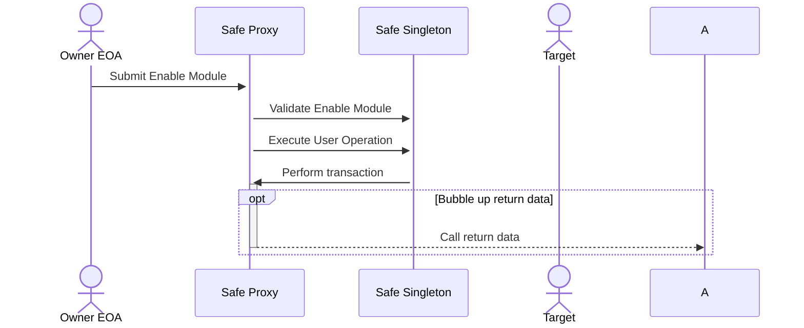
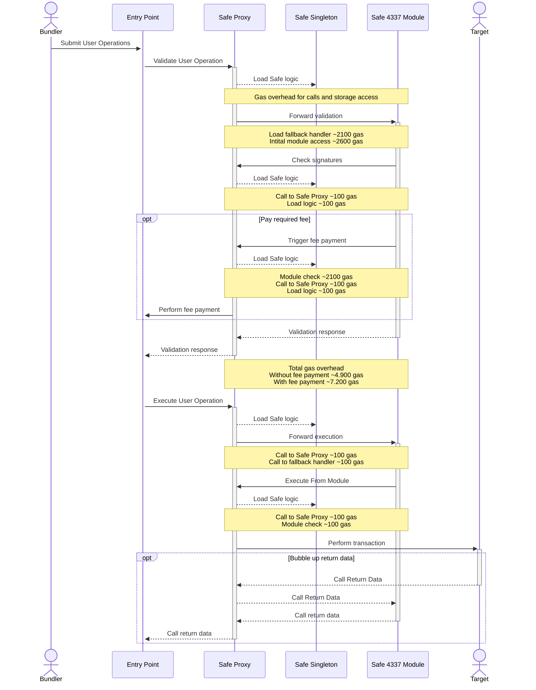

# Palmera Module Principal of Diagrmas - Technical Specification

## Table of Contents

- Project Overview
- Functional Requirements
  - 1.1. Enable Module and Guard
  - 1.2. Roles and Authorizations
  - 1.3. Features
  - 1.4. Business Logic
  - 1.5. Use Cases
- Technical Requirements
  - 2.1. Deployment Instructions
  - 2.2. Architectural Overview
  - 2.3. Contract Information

## Project Overview

The Palmera Module is an orchestration framework for On-Chain Organizations based on the Safe ecosystem, enabling the creation and management of hierarchies and permissions within On-Chain Organizations. It extends the capabilities of Safe’s multisig wallet to manage assets and treasury in a secure and hierarchical manner. More Details in [Palmera Module Docs](https://docs.palmeradao.xyz/palmera).

## Functional Requirements

### 1.1. Enable Module and Guard

#### 1.1.1. Enable Module

### 1.2. Roles and Authorizations

