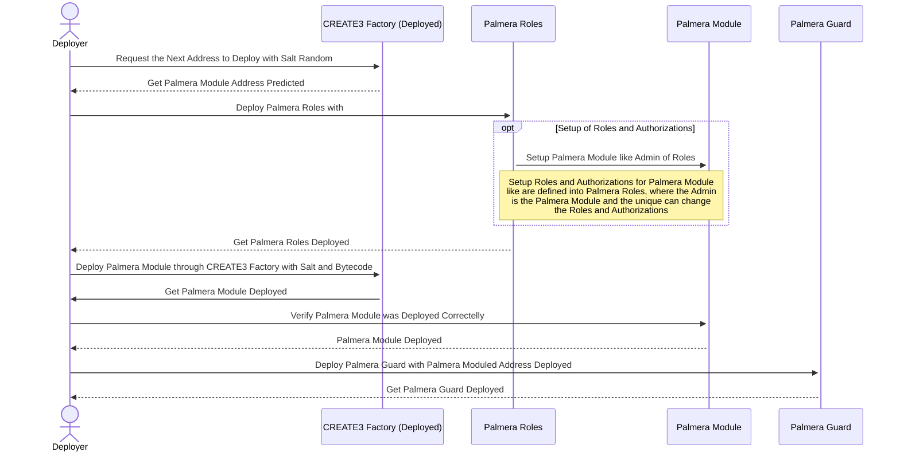
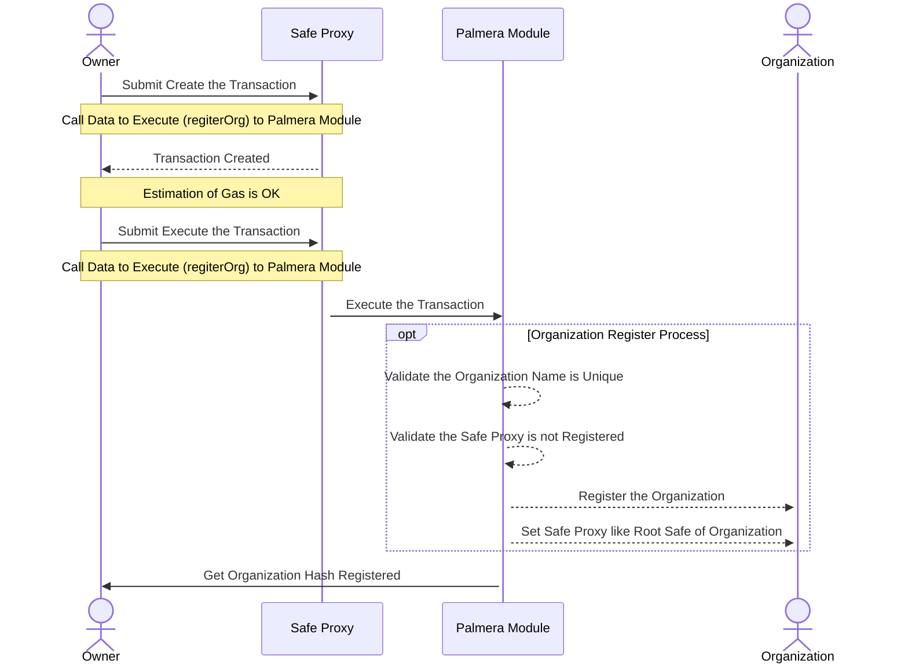
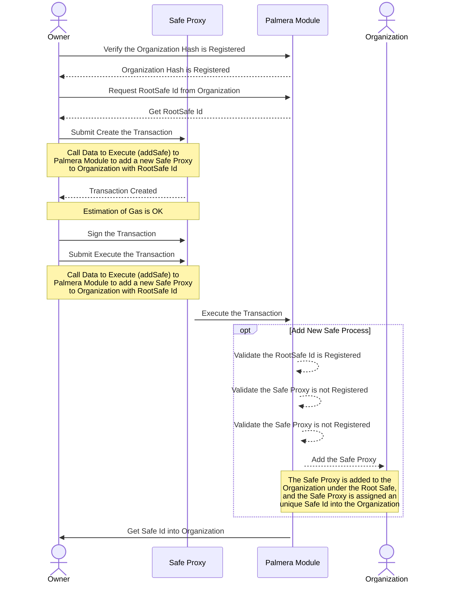
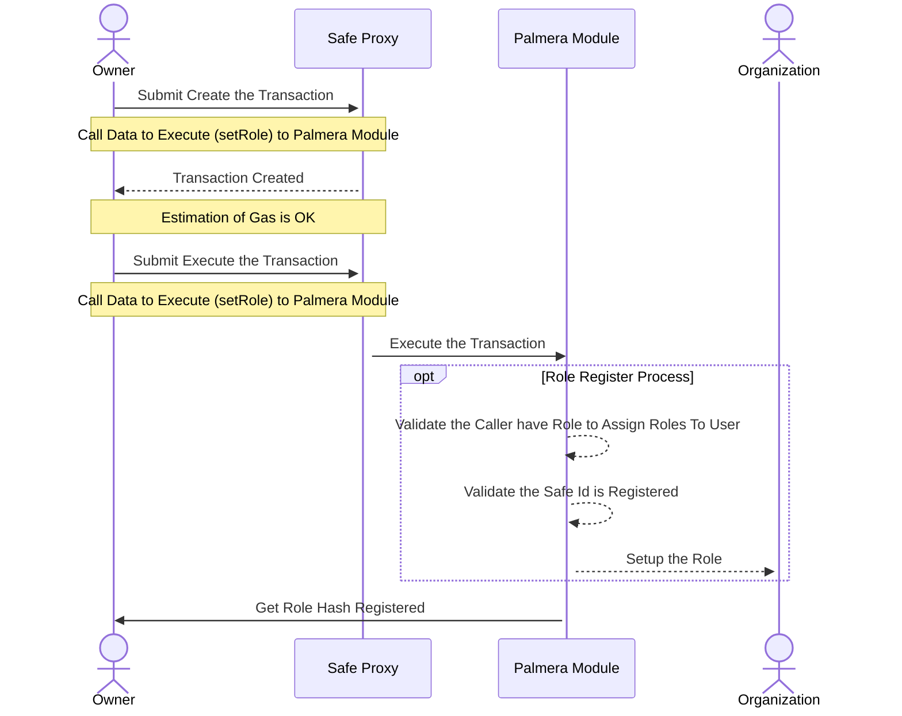
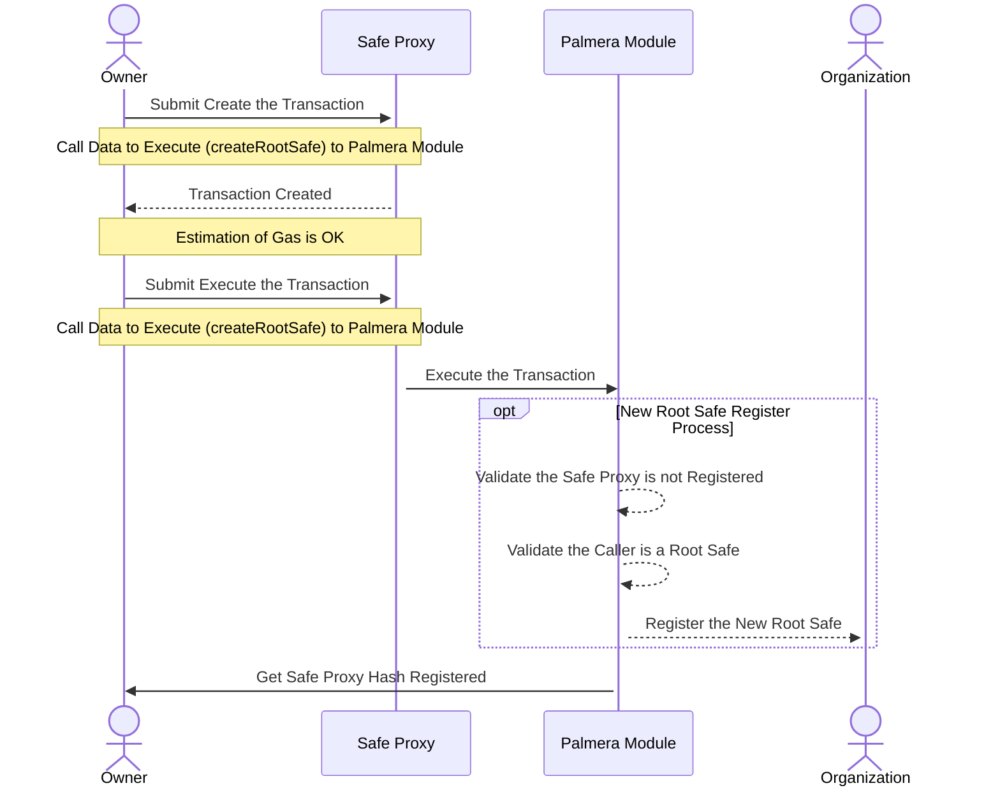
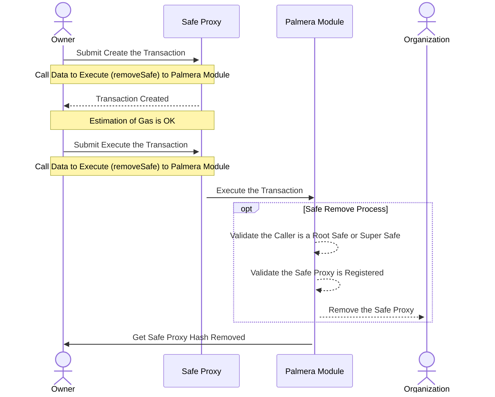
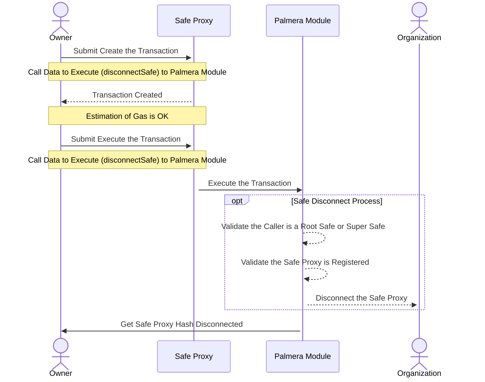
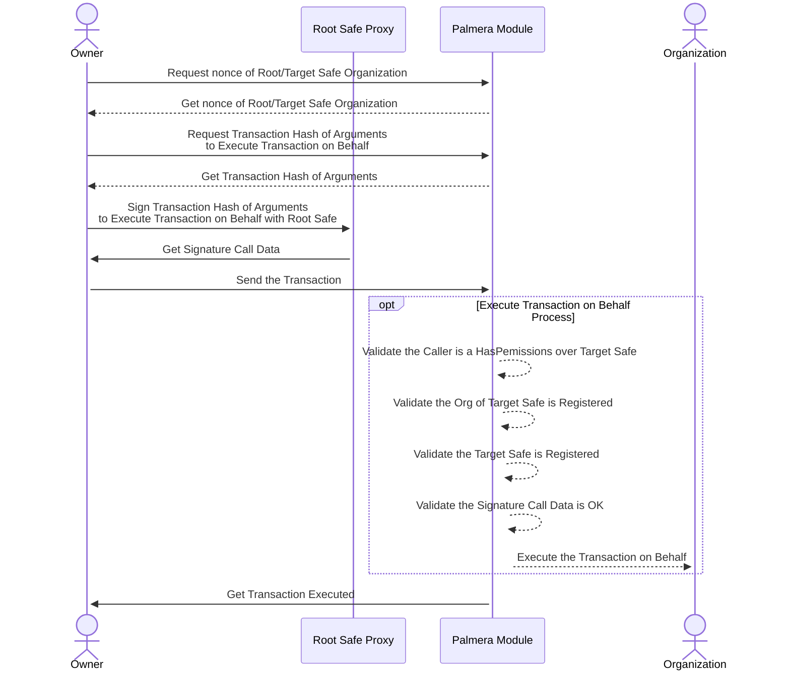

# Palmera Module Principal of Diagramas - Technical Specification

## Table of Contents

- Project Overview
- Functional Requirements
  - 1.1. Enable Module and Guard
  - 1.2. Roles and Authorizations
  - 1.3. Features
    - Register a New On-Chain Organization
    - Add a New Safe
    - Add New Roles
    - Add a New Root Safe
    - Remove a Safe
    - Disconnect a Safe
    - Execute a Transaction on Behalf Of

## Project Overview

The Palmera Module is an orchestration framework for On-Chain Organizations based on the Safe ecosystem, enabling the creation and management of hierarchies and permissions within On-Chain Organizations. It extends the capabilities of Safe’s multisig wallet to manage assets and treasury in a secure and hierarchical manner. More Details in [Palmera Module Docs](https://docs.palmeradao.xyz/palmera).

## Functional Requirements

### 1.1. Enable Module and Guard

if you wanna to see in details the process to Enable Module and Set Guard, follow the docs and diagrams in:

- To Enable Module: [Safe Modules](https://docs.safe.global/advanced/smart-account-modules)
- Set Guard: [Safe Guard](https://docs.safe.global/advanced/smart-account-guards)

### 1.2. Roles and Authorizations

In this point we see the initial setup between Palmera Roles and Palmera Module, for Setup the Roles using the Solmete Auth / Roles Library, and the next steps to Deploy all Palmera Module and Guard.

### 1.3. Features

- **Hierarchical Management**: Palmera Module allows the creation of hierarchical structures within the organization, enabling the creation of sub-organizations and the management of permissions and assets in a hierarchical manner.

- **Permission Management**: Palmera Module allows the management of permissions within the organization, enabling the creation of roles and authorizations for each role.

- **Asset Management**: Palmera Module allows the management of assets within the organization, enabling the creation of treasury and the management of assets in a secure manner.

- **Governance Management**: Palmera Module allows the management of governance within the organization, enabling the creation of voting mechanisms and the management of proposals in a secure manner.

#### Register a New On-Chain Organization

#### Add a New Safe

Function: addSafe()
Description: Adds a new root safe. Only an existing root safe can add another root safe.

#### Add New Roles

Function: setRole()
Description: Assigns a new role to a user. This must be called by the root safe.

#### Add a New Root Safe

Function: createRootSafe()
Description: A safe can become a Root Safe into On-chain Organization, and handle a different leaf.

#### Remove a Safe

Function: removeSafe()
Description: Removes a safe. This must be called by the root safe.

#### Disconnect a Safe

Function: disconnectSafe()
Description: Disconnects a safe from the organization. This must be called by the root safe.

#### Execute a Transaction on Behalf Of

Function: execTransactionOnBehalf()
Description: Allows a root/super safe or safe lead to execute transactions on behalf of a sub/child safe.

